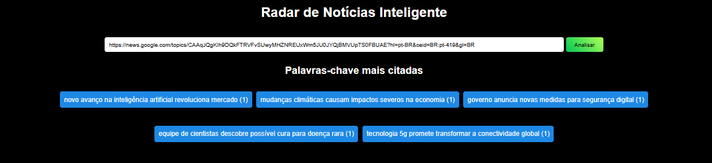

  <h1>
    
    
    
  </h1>

    

## Descrição 
O **Radar de Notícias Inteligente** é uma ferramenta desenvolvida para analisar manchetes de sites de notícias e identificar as palavras-chave mais frequentes. O projeto utiliza **NLP (Processamento de Linguagem Natural)** para extrair termos dominantes e prever tendências de interesse público ao longo do tempo.

## Funcionalidades 
- Permite ao usuário inserir **URLs de sites de notícias**.
- Utiliza **NLP** para detectar temas dominantes nas manchetes.
- Exibe palavras-chave mais citadas em manchetes recentes.
- Gera **gráficos interativos** mostrando a recorrência de termos.

## Testes de Software
- **Teste de depuração:** Identifica erros no funcionamento da análise de URLs.
- **Teste de funcionamento:** Garante que as palavras-chave sejam extraídas corretamente.
- **Captura do teste realizado:**

## Tecnologias e Linguagens  

  

## Bibliotecas e Frameworks  

  

## Documentação
- [Documentação do Vue.js](https://vuejs.org/)
- [Documentação do TensorFlow.js](https://www.tensorflow.org/js)
- [Documentação do GitHub](https://docs.github.com/)

